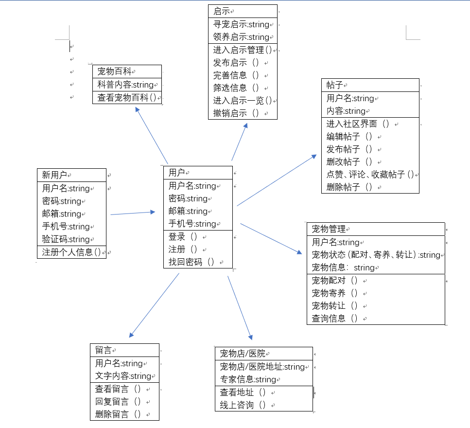
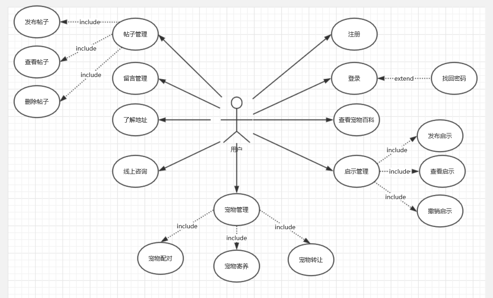
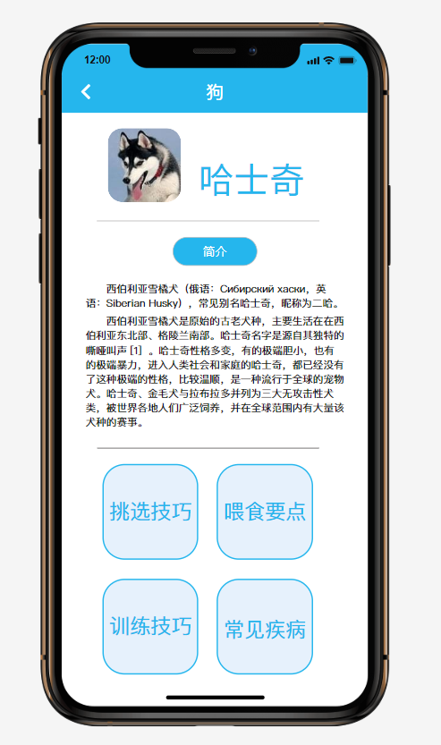
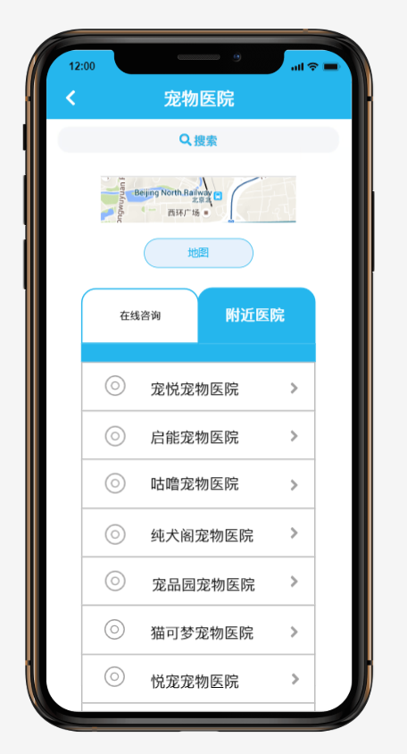
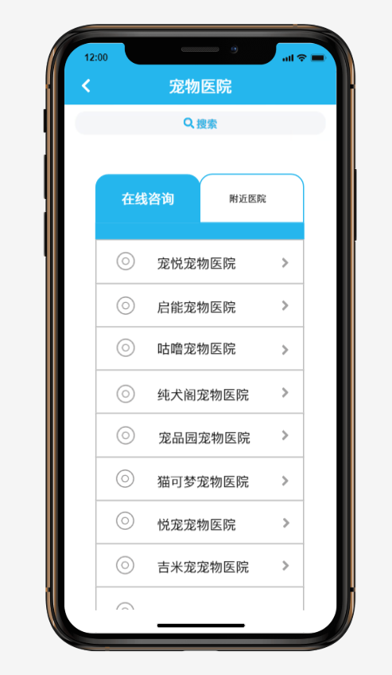
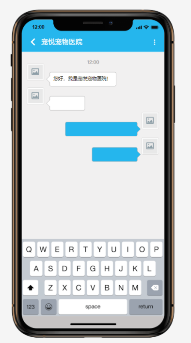
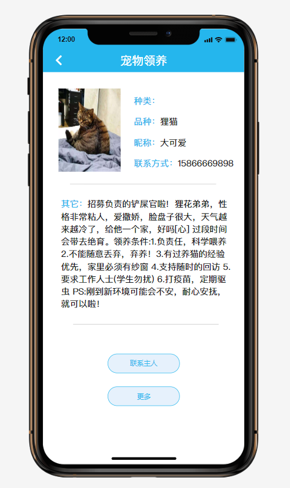
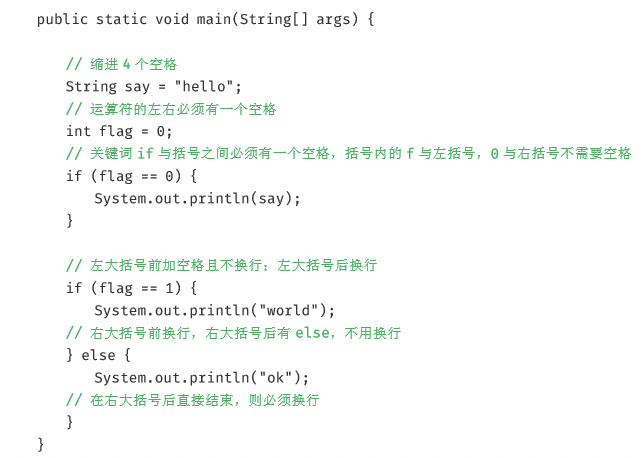

**软件需求规格说明书**

**小组名称：十分宠爱**

**小组项目：宠爱有家**

**2019年10月26日**

1 引言
======

1.1 目的
--------

该文档首先给出项目的整体结构和功能结构概貌，试图从总体架构上给出整个系统的轮廓。同时对功能需求、性能需求进行了详细的描述。便于用户、开发人员进行理解和交流，反映出用户问题的结构，可以作为软件开发工作的基础和依据以及确认测试和验收的依据。

本文档面向多种读者对象：

（1）项目经理：项目经理可以根据该文档了解预期产品的功能，并据此进行系统设计、项目管理。

（2）设计员：对需求进行分析，并设计出系统，包括数据库的设计。

（3）程序员：了解系统功能，编写《用户手册》。

（4）测试员：根据本文档编写测试用例，并对软件产品进行功能性测试和非功能性测试。

（5）用户：了解预期产品的功能和性能，并与分析人员一起对整个需求进行讨论和协商。

在阅读本文档时，首先要了解产品的功能概貌，然后可以根据自身的需要对每一功能进行适当的了解。

1.2 项目背景
------------

软件名称：宠爱有家

项目开发者：十分宠爱小组

背
景：如今养宠物的人越来越多，也有不少除了传统以外的异宠，比如雪貂、刺猬、豚鼠之类的，很多人养了宠物却不了解宠物的习性，所以就开发这款关于主打科普萌宠知识的app。

这个app不止收纳了各种宠物知识，还有更多丰富实用的功能。当主人发现宠物状态不对劲时，查找附近的宠物医院，为主人筛选最适合的医院；当主人急着为宠物买宠物用品时，搜索附近的宠物店；社区功能提供了主人们晒宠物、交流养宠物的平台；为宠物丢失、宠物配对、宠物寄养、宠物转让
提供渠道。

1.3 参考资料
------------

1.  构建之法，邹欣，2017.07，人民邮电出版社

2.  软件需求规格说明书标准模板，迪迈科技，2015.07.10

2 总体描述
==========

2.1 开发意图
------------

该宠物app是一款综合类型app，集宠物知识、宠物日用、宠物社交。现在很多人对于自己的宠物没有一个清晰的了解，当宠物生病了没有合适的解决办法；宠物丢了，提供一个寻找宠物的平台，不再局限于朋友圈；急需宠物用品不知道去哪买，所以开发这个app来帮助用户解决生活中的小困扰。

2.2 应用目标和作用范围
----------------------

这是一款集宠物知识、宠物轻社交、宠物日常需求为一身的综合类app，解决养宠人士生活中的小问题，为人们提供便利。作用群体主要是在养宠物和打算样宠物的用户。

2.3 产品前景
------------

产品面向的用户真实需要，并且在与现有的已
上市的app相比较，我们的app在普遍的功能基础上还有寻宠启示、宠物配对、线上咨询医生等特殊功能，更具有市场竞争力。

2.4 一般约束
------------

进行本软件开发工作的约束条件如下：

1.开发周期短：开发时间需要开发者合理规划时间，做到多项任务并发。

2.所采用的方法与技术有限：项目团队成员的技术水平不够成熟，需要在开发中并发学习多种技术和能力。

2.5 假设与依据
--------------

本项目是否能够成功实施，主要取决于以下的条件：

（1）团队成员的积极合作配合，为了项目的开发和实施，对个人时间进行合理规划同时为团队做出合理牺牲，配合队友完成任务。

（2）团队掌握先进的能够适用于该项目的技术，这是系统的性能是否优化和项目能否成功的保证。

3 具体要求
==========

3.1 类图
--------

3.2 属性
--------

### 3.2.1 可用性

1. 易操作，易理解：下载至手机后即可登陆使用，各个界面简洁易懂；

1.  容错能力：系统具有一定的容错和抗干扰能力，当用户输入格式错误时，系统有提示并可以再次输入；

2.  并发性：能够保证一定量的用户同时在线

### 3.2.2 安全性

1. 重要数据加密：对一些重要的数据利用可靠的加密技术进行加密，如用户密码等；

2.
权限控制：根据用户角色，设置相应的权限，用户的重要操作都做成相应的历史记录以备查看。用户只能管理自己的个人信息，无法对别人的信息进行管理；

3. 数据备份：允许用户进行数据的备份和恢复，以弥补数据的破坏和丢失。

3.3客户用例图
-------------

3.4用例说明
-----------

用例1:注册

主要参与者:新用户

目标:新用户通过系统注册个人信息

前提条件:无

场景:

1.  注册者:点击”注册”。

2.  注册者:输入用户名。

3.  注册者:输入密码。

4.  注册者:再一次输入密码。

5.  注册者:输入邮箱/手机号获取验证码以绑定用户名。

6.  注册者:输入验证码。

7.  注册者:点击”完成注册”。

8.  系统:保存注册者的用户名密码,注册成功。

异常：

1.  用户名重复：系统提示用户名已被注册；注册者重新输入用户名直到合法为止。

2.  输入密码过于简单：系统提示密码过于简单；注册者重新输入密码直到满足一定复杂度为止。

3.  两次密码输入不一致：系统提示密码不匹配；注册者重新输入密码知道两次密码一致为止。

4.  验证码错误：系统提示验证码错误；用户重新输入验证码或者重新获取验证码知道输入正确验证码为止。

用例2：登录

主要参与者：用户

目标：用户通过登录界面进入APP

前提条件:无

场景:

1.  用户:输入用户名。

2.  用户:输入密码。

3.  用户:点击”登录”。

4.  用户：登录成功。

异常：

1.  用户名未注册：系统提示该用户名未注册；用户重新输入已注册的用户名或者进行注册。

2.  用户名或者密码输入错误：系统提示用户名或者密码输入错误；用户重新输入直到用户名与密码匹配。

3.  用户忘记密码：用户点击“找回密码”进行密码的找回/重置。

用例3：查看宠物百科

主要参与者：用户

目标：使用户能了解宠物各方面的信息

前提条件：用户已成功登录APP

场景：

1.  用户：点击“宠物百科”进入相应界面。

用例4:发布启示

主要参与者:用户

目的:用户发布寻宠启示或者领养启示

前期条件:进入”启示管理”界面

场景:

1.  用户:点击”发布启示”。

2.  用户：填写发布启示所需的信息。

3.  用户：点击“发布”。

4.  用户：发布成功。

异常：

1.必填信息未填写：系统提示必填信息需全部填写；用户完善信息。

用例5：查看启示

主要参与者：用户

目的：用户对发布的启示进行查看

前提：无

场景：

1.  用户:点击“启示”进入启示界面。

2.  用户:点击“寻宠启示”或者“领养启示”可切换查看

3.  用户:在筛选栏选择/输入筛选信息，可查看筛选后的信息。

4.  用户:点击某个启示可查看其详细信息。

用例6:撤销启示

主要参与者:用户

目的:用户对失效的启示进行撤销

前提条件:用户有发布且为撤销的启示;用户进入”启示管理”界面

场景:

1.  用户:点击”我的启示”,进入启示一览的界面。

2.  用户：找到需要撤销的启示，点击“撤销”。

3.  系统：询问是否确定撤销。

4.  用户：确定撤销，撤销成功。

用例7：发帖

主要参与者：用户

目的：用户发帖进行交友、交流

前提条件：用户进入“社区”界面

场景：

1.  用户：点击“发布”，进入编辑帖子的界面。

2.  用户：编辑需要发布的信息。

3.  用户：点击“发布”。

4.  系统：发布成功。

异常：

1.  内容字数过多：系统提示超过字数上限；用户对内容进行删改使其符合字数限制规则。

2.  内容含有敏感信息：系统提示内容含有敏感信息；用户对内容进行删改使其不包含敏感信息。

用例8：看帖

主要参与者:用户

目的:用户通过看帖消磨时光、增长见识、查找需要的信息

前提条件：无

场景：

1.  用户：点击“社区”进入社区界面。

2.  用户：可对感兴趣的帖点赞、评论、收藏。

用例9：删帖

主要参与者：用户

目的：用户删除不想要的帖

前提条件：用户有发布且还未删除的帖；用户进入“社区”界面

场景：

1.  用户：点击“我的帖子”，进入帖子一览的界面。

2.  用户：找到要删的帖，点击删除。

3.  系统：询问是否确定删除。

4.  用户：确定删除，删除成功。

用例10：留言管理

主要参与者：用户

目的：用户对留言信息管理

前提条件：用户有其他用户发送的留言

场景:

1.  用户:点击”留言”进入相应界面。

2.  用户：查看留言，可对留言进行回复或删除。

用例11:了解地址

主要参与者:用户

目的:使用户了解附近宠物店/医院的地址

前提条件:打开定位功能

场景:

1.  用户:点击”医疗保健”进入相应界面。

2.  用户：点击“宠物店/医院”进入相应界面查看地址。

用例12：线上咨询

主要参与者：用户

目的：用户可在线咨询专家有关宠物生病或异常状况相关的信息

前提条件：无

场景：

1.  用户：点击“医疗保健”进入相应界面。

2.  用户：点击“线上咨询”。

3.  用户：点击想咨询的专家进行咨询。

用例13:宠物管理（发布）

主要参与者：用户

目的：用户可通过平台发布宠物配对、宠物寄养、宠物转让信息

前提条件：无

场景：

1.  用户：点击宠物管理进入界面

2.  用户：点击我要发布，

3.  系统：弹出宠物配对、宠物寄养、宠物转让窗口

4.  用户：点击想要进行操作的窗口

5.  用户：输入要发布的信息

用例14:宠物管理（查询）

主要参与者：用户

目的：用户可通过平台查询宠物配对、宠物寄养、宠物转让信息

前提条件：无

场景：

1.用户：点击宠物管理进入界面，

2.系统：弹出宠物配对、宠物寄养、宠物转让窗口

3.用户：点击想要进行操作的窗口

4.用户：输入要查找的信息

3.5外部接口需求
---------------

### 3.5.1 用户接口

本系统采用C/S架构，所有界面使用APP风格，用户界面的具体细在功能需求文档中描述。

### 3.5.2 硬件接口

无特殊需求。

### 3.5.3 软件接口

无特殊需求。

### 3.5.4 通信接口

无特殊需求。

4 界面原型
==========

动态发布界面：

**宠物百科**界面：

宠物管理界面：

宠物医院/宠物店界面：

线上咨询界面：

启示管理

5 验收验证标准
==============

一、注册登录

| 测试功能 | 测试项   | 操作                                     |   | 检验点                       | 测试功能                                                                  | 完成情况 |
|----------|----------|------------------------------------------|---|------------------------------|---------------------------------------------------------------------------|----------|
| 登录注册 | 登录页面 |                                          |   | 账号框（限制6-20位输入）     | 显示“请输入您的账号”，当输入长度超过20位或少于6位的字符串时，提示账号无效 |          |
|          |          |                                          |   | 密码框（限制6-20位输入）     | 显示“请输入您的账号”，当输入长度超过20位或少于6位的字符串时，提示密码无效 |          |
|          |          |                                          |   | 记住密码选框                 | 默认不勾选                                                                |          |
|          | 登录动作 | 不输入信息，点击登录                     |   | 确认功能、结果显示           | 无法登录，警告提示“请输入账号和密码”                                      |          |
|          |          | 仅输入账号或密码（输入格式正确）         |   | 确认功能、结果显示           | 无法登录，警告提示“请输入账号和密码”                                      |          |
|          |          | 输入账号和密码，其中一对一错             |   | 确认功能、结果显示           | 无法登录，警告提示“请输入账号和密码”                                      |          |
|          |          | 账号或密码格式错误                       |   | 确认功能、结果显示           | 无法登录，警告提示“请输入账号和密码”                                      |          |
|          |          | 输入正确的账号和密码                     |   | 确认功能、结果显示           | 登录成功，进入首页                                                        |          |
|          |          | 点击忘记密码按钮                         |   | 确认功能、结果显示           | 进入密码找回界面                                                          |          |
|          | 注册页面 |                                          |   | 账号框（限制6-20位输入）     | 显示“手机号”，当输入非手机号时，提示手机号无效                            |          |
|          |          |                                          |   | 密码框（限制6-20位输入）     | 显示“密码”，当输入字符长度不正确时，提示密码无效                          |          |
|          |          |                                          |   | 确认密码框（限制6-20位输入） | 显示“确认密码”，当输入字符与“密码框”不同时，提示两次密码输入不一致        |          |
|          | 注册动作 | 不输入信息，点击注册                     |   | 确认功能、结果显示           | 无法注册，警告提示“请输入账号和密码”                                      |          |
|          |          | 仅输入账号或密码两者之一（输入格式正确） |   | 确认功能、结果显示           | 无法注册，警告提示“请输入账号和密码”                                      |          |
|          |          | 输入正确的账号、密码和验证码             |   | 确认功能、结果显示           | 注册成功，进入个人信息填写页面                                            |          |

1.  查看宠物百科

| 测试功能 | 测试项   | 操作               |   | 检验点             | 测试功能                                           | 完成情况 |
|----------|----------|--------------------|---|--------------------|----------------------------------------------------|----------|
| 宠物百科 | 查找动作 | 点击更多按钮       |   | 确认功能、结果显示 | 点击后展开更多宠物大类，页面其余功能保持不变       |          |
|          |          |                    |   | 品种查找选项框     | 品种查找选项框默认不勾选                           |          |
|          |          | 点击品种查找选项框 |   | 确认功能、结果显示 | 品种查找选项框下的品种图片根据用户选择做出相应改变 |          |
|          |          | 点击宠物品种图片   |   | 确认功能、结果显示 | 跳转至相应品种的百科资料页面                       |          |

2.  发布查看启示

| 测试功能     | 测试项   | 操作                           |   | 检验点               | 测试功能                                                               | 完成情况 |
|--------------|----------|--------------------------------|---|----------------------|------------------------------------------------------------------------|----------|
| 发布查看启示 | 发布启示 | 点击“发布启示”按钮             |   | 发布启示按钮         | 跳转至填写发布启示所需信息页面                                         |          |
|              |          | 点击“提交”                     |   | 填写发布启示信息页面 | 检验必填信息是否填写，若没有，警告提示“还有必填信息未填写”，页面不跳转 |          |
|              |          |                                |   | 填写发布启示信息页面 | 检验必填信息是否填写，若均填写，跳转至发布成功页面                     |          |
|              | 查看启示 | 点击“启示”按钮                 |   | 确认功能、结果显示   | 跳转至启示界面，默认为寻宠启事界面                                     |          |
|              |          | 点击“领养启示”按钮             |   | 领养启示按钮         | 页面切换至领养启示界面                                                 |          |
|              |          | 点击“寻宠启示”按钮             |   | 寻宠启示按钮         | 页面切换至寻宠启示界面                                                 |          |
|              |          | 点击筛选栏选择列表后的确定按钮 |   | 确认功能、结果显示   | 页面切换至筛选后的信息页面                                             |          |
|              |          | 点击具体启示标题               |   | 确认功能、结果显示   | 页面跳转至具体启示页面                                                 |          |
|              |          | 点击联系失主按钮               |   | 确认功能、结果显示   | 页面跳转至与失主的留言页面                                             |          |
|              | 撤销启示 | 点击“我的启示”按钮             |   | 确认功能、结果显示   | 页面跳转至“启示一览”界面                                               |          |
|              |          |                                |   | 确认功能、结果显示   | 显示所有已发布启示                                                     |          |
|              |          | 点击具体启示后的撤销按钮       |   | 确认功能、结果显示   | 弹出窗口“是否确定撤销”                                                 |          |
|              |          | 点击确定按钮                   |   | 确认功能、结果显示   | 删除启示，弹出删除成功窗口                                             |          |
|              |          | 点击取消                       |   | 确认功能、结果显示   | 页面不变                                                               |          |

3.  社区界面

| 测试功能 | 测试项 | 操作                     |   | 检验点             | 测试功能                                               | 完成情况 |
|----------|--------|--------------------------|---|--------------------|--------------------------------------------------------|----------|
| 贴子操作 | 发贴   | 点击“发布”按钮           |   | 确认功能、结果显示 | 跳转至编辑贴子界面                                     |          |
|          |        | 点击“发布”按钮           |   | 贴子字数           | 若贴子字数超出限制范围，警告提示“发布内容超过字数上限” |          |
|          |        |                          |   | 贴子内容           | 若贴子内容包含敏感字符，警告提示内容含有敏感信息       |          |
|          |        |                          |   | 确认功能、结果显示 | 若均无异常，警告弹窗“确认发布？”                       |          |
|          |        | 点击“确定”按钮           |   | 确认功能、结果显示 | 弹出信息“发布成功”                                     |          |
|          |        | 点击“取消”               |   | 确认功能、结果显示 | 页面保持不变                                           |          |
|          | 看帖   | 点击具体贴子标题         |   | 确认功能、结果显示 | 跳转至具体贴子详细信息页面                             |          |
|          |        | 点击点赞按钮             |   | 确认功能、结果显示 | 赞数加一                                               |          |
|          |        | 在评论栏的确定按钮       |   | 确认功能、结果显示 | 发布评论                                               |          |
|          |        | 点击收藏按钮             |   | 确认功能、结果显示 | 收藏夹中加入此贴子链接                                 |          |
|          | 删帖   | 点击我的贴子按钮         |   | 确认功能、结果显示 | 进入贴子一览界面                                       |          |
|          |        | 点击贴子标题后的删除按钮 |   | 确认功能、结果显示 | 弹出窗口“是否确定删除”                                 |          |
|          |        | 点击确定按钮             |   | 确认功能、结果显示 | 删除贴子链接，显示弹出成功信息                         |          |

五、留言管理

| 测试功能 | 测试项   | 操作               |   | 检验点             | 测试功能               | 完成情况 |
|----------|----------|--------------------|---|--------------------|------------------------|----------|
| 留言     | 留言回复 | 点击留言按钮       |   | 确认功能、结果显示 | 跳转至留言界面         |          |
|          |          | 点击留言栏具体标题 |   | 确认功能、结果显示 | 跳转至留言具体内容界面 |          |
|          |          | 点击回复按钮       |   | 确认功能、结果显示 | 跳转至编写回复留言界面 |          |
|          | 留言删除 | 点击删除留言按钮   |   | 确认功能、结果显示 | 删除此留言链接         |          |

六、爱宠中心

| 测试功能 | 测试项       | 操作                           |   | 检验点         | 测试功能                                   | 完成情况 |
|----------|--------------|--------------------------------|---|----------------|--------------------------------------------|----------|
| 爱宠中心 |              | 点击爱宠中心按钮               |   | 爱宠中心按钮   | 跳转至功能选择界面                         |          |
|          | 宠物医院模块 | 点击宠物医院按钮               |   | 宠物医院按钮   | 跳转至“附近医院”界面                       |          |
|          |              | 点击“附近医院”按钮             |   | “附近医院”按钮 | 切换至“附近医院”界面                       |          |
|          |              | 点击“在线咨询”按钮             |   | “在线咨询”按钮 | 切换至专家列表显示页面                     |          |
|          |              |                                |   | “附近医院”页面 | 罗列同城所有宠物店以及宠物医院名称以及地址 |          |
|          |              | 点击“地图”按钮                 |   | “地图”按钮     | 跳转至地图界面                             |          |
|          |              | 在线咨询界面下在搜索栏填入信息 |   | 搜索栏         | 显示与信息相关列表                         |          |
|          |              | 附近医院界面下再搜索栏填入信息 |   | 搜索栏         | 显示与信息相关列表                         |          |

1.  宠物管理

| 测试功能 | 测试项   | 操作                                             |   | 检验点                             | 测试功能                                             | 完成情况 |
|----------|----------|--------------------------------------------------|---|------------------------------------|------------------------------------------------------|----------|
| 宠物管理 |          | 点击宠物管理按钮                                 |   | 宠物管理按钮                       | 跳转至功能选择页面                                   |          |
|          | 发布模块 | 点击“我要发布”按钮                               |   | “我要发布”按钮                     | 弹出包含“宠物配对、宠物寄养、宠物转让按钮”的窗口选项 |          |
|          |          | 点击“宠物配对、宠物寄养、宠物转让”按钮之一的选项 |   | “宠物配对、宠物寄养、宠物转让”按钮 | 跳转至相应界面                                       |          |
|          |          | 点击“发布”按钮                                   |   | “发布”按钮                         | 跳转至发布页面                                       |          |
|          | 查询模块 | 在查找栏输入信息                                 |   | 查找栏                             | 若有相关信息，跳转至罗列信息列表界面                 |          |
|          |          |                                                  |   | 查找栏                             | 若无相关信息，跳转至空白信息列表界面显示“无相关信息” |          |

附录一：编程规约
================

(一) 命名风格

1. 【强制】代码中的命名均不能以下划线或美元符号开始，也不能以下划线或美元符号结
束。

反例:_name / \__name / \$name / name\_ / name\$ / name__2.
【强制】代码中的命名严禁使用拼音与英文混合的方式，更不允许直接使用中文的方式。

-   说明:正确的英文拼写和语法可以让阅读者易于理解，避免歧义。注意，即使纯拼
    
音命名方式 也要避免采用。


    反例:DaZhePromotion [打折] / getPingfenByName() [评分] / int 某变量 = 3
    
3. 【强制】类名使用 UpperCamelCase 风格，但以下情形例外:DO / BO / DTO / VO
    / AO / PO / UID 等。
正例:MarcoPolo / UserDO / XmlService / TcpUdpDeal /
    TaPromotion
反例:macroPolo / UserDo / XMLService / TCPUDPDeal /
    TAPromotion4. 【强制】方法名、参数名、成员变量、局部变量都统一使用
    lowerCamelCase 风格，必 须遵从 驼峰形式。
正例: localValue /
    getHttpMessage() / inputUserId5.
    【强制】常量命名全部大写，单词间用下划线隔开，力求语义表达完整清楚，不要嫌名
    字长。
正例:MAX_STOCK_COUNT 反例:MAX_COUNT6. 【强制】抽象类命名使用
    Abstract 或 Base 开头;异常类命名使用 Exception 结尾;
    测试类命名以它要测试的类的名称开始，以 Test 结尾。7.
    【强制】类型与中括号紧挨相连来表示数组。


-   正例:定义整形数组 int[] arrayDemo; 在 main 参数中，使用 String[] args 来
    定义


    反例:在 main 参数中，使用 String args[]来定义。8.
    【强制】包名统一使用小写，点分隔符之间有且仅有一个自然语义的英语单词。包名统
    一使用单数形式，但是类名如果有复数含义，类名可以使用复数形式。
    
正例:应用工具类包名为 com.alibaba.ai.util、类名为 MessageUtils(此规则
    参考 spring 的框架结构)
9. 【强制】杜绝完全不规范的缩写，避免望文不知义。
    
反例:AbstractClass“缩写”命名成 AbsClass;condition“缩写”命名成 condi，
    此类随意缩写严重降低了代码的可阅读性。
    
10.【推荐】为了达到代码自解释的目标，任何自定义编程元素在命名时，使用尽量完整的
    单词组合来表达其意。


正例:在 JDK 中，表达原子更新的类名为:AtomicReferenceFieldUpdater。 反例:变量
int a 的随意命名方式。

(二) 代码格式

1.【强制】大括号的使用约定。如果是大括号内为空，则简洁地写成{}即可，
不需要换行;如果是非空代码块则:

-   左大括号前不换行。


    左大括号后换行。


    右大括号前换行。


    右大括号后还有 else 等代码则不换行;表示终止的右大括号后必须换
    
行。2.【强制】if/for/while/switch/do 等保留字与括号之间都必须加空格。
    3.【强制】采用 4 个空格缩进，禁止使用 tab 字符。说明:如果使用 tab
    缩进，必须设置 1 个 tab 为 4 个空格。IDEA 设置
tab 为 4 个空格时， 请勿勾选
    Use tab character;而在 eclipse 中，
必须勾选 insert spaces for tabs
    正例:涉及1-3点


(三) 注释规约

1.【强制】类、类属性、类方法的注释必须使用 Javadoc
规范，使用/\*\*内容\*/格式，不得使用 // xxx 方式。说明:在 IDE
编辑窗口中，Javadoc 方式会提示相关注释，生成 Javadoc 可以正确输出相应注释;在 IDE
中，工程调用方法时，不进入方法即可

悬浮提示方法、参数、返回值的意义，提高阅读效率。
2.【强制】所有的抽象方法(包括接口中的方法)必须要用 Javadoc 注释、除
了返回值、参数、异常说明外，还必须指出该方法做什么事情，实现什么功能。

说明:对子类的实现要求，或者调用注意事项，请一并说明。
3.【强制】所有的类都必须添加创建者和创建日期。
4.【强制】方法内部单行注释，在被注释语句上方另起一行，使用//注释。方法
内部多行注释 使用/\* \*/注释，注意与代码对齐。
5.【强制】所有的枚举类型字段必须要有注释，说明每个数据项的用途。
6.【推荐】与其“半吊子”英文来注释，不如用中文注释把问题说清楚。专有名
词与关键字保持英文原文即可。

反例:“TCP连接超时”解释成“传输控制协议连接超时”，理解反而费 脑筋。

7.【推荐】代码修改的同时，注释也要进行相应的修改，尤其是参数、返回值、
异常、核心逻辑等的修改。

说明:代码与注释更新不同步，就像路网与导航软件更新不同步一样，
如果导航软件严重滞后，就失去了导航的意义。

8.【参考】谨慎注释掉代码。在上方详细说明，而不是简单地注释掉。如果无用，
则删除。

说明:代码被注释掉有两种可能性:(1)后续会恢复此段代码逻辑。(2)
永久不用。前者如果没有备注信息，难以知晓注释动机。后者建议直接
删掉(代码仓库保存了历史代码)。

(四) 安全规约

1.
【强制】隶属于用户个人的页面或者功能必须进行权限控制校验。说明:防止没有做水平权限校验就可随意访问、修改、删除别人的数据，比如查看他人的私信内容。

附录二：文档编写原则
====================

(一) 好的 SRS 的特征

SRS 宜是:(1)正确;(2)无歧义;(3)完备;(4)一致; (5)重要性和/或稳定性分级; (6)可验证;

(7)可修改; (8)可追踪。

(二) 文档写作基本要求

-   文档封页、页眉页脚、修订记录、附录、参考文献应完善;


    关键词、摘要、缩略语应完整;


    目录要及时更新;


    通篇文档标题、文字格式、间距应协调美观;


    所有文档模板中的章节，只可增加，不可删除;


    图号置于图形之下，表号置于表格之上;


    句子和段落要短;


    使用语言应严谨，不要使用白话;


    采用主动语气;


    不要出现“我们”、“你们”、“他们”这样的称谓，或“这个”、“那

    个”这样的词，应使用“本××”、“该××”、“其”;

    表述清晰，避免引起歧义;


    通篇文档细节上要保持一致;


    功能需求划分应合理


    保持语句和段落的简短。


    需求陈述应该具有一致的样式。例如“系统必须......”或者“用户必

    须......”，并紧跟一个行为动作和可观察的结果。

    必须避免模糊的、主观的术语，减少不确定性。


例如:也许、大概、可能、界面友好、容易、简单、美观、迅速、有效、支

持、许多、最新技术、优越的、可接受的和健壮的。

-   避免使用比较性的词汇，例如:提高、最大化、最小化和最佳化。定量地说

    明所需要提高的程度或者说清一些参数可接受的最大值和最小值。

    不应该把多个需求集中在一个冗长的叙述段落中。务必记住:不要在需求说
    
明中使用“和/或”，“等等”之类的连词。

    
(三) 功能需求写作基本要求


-   每个功能需求分配唯一编号，且给出一有意义的标题，便于检索。标题通常是动
    宾词组，不要使用“功能需求一/二”这样的描述。


    是描述 What to do，而不是 How to do;


    介绍部分描述“做什么”没有意义


    处理部分可以采用C语言中关键词如if、else、while等辅助描述，这样在时
    
序、逻辑上更清晰;


    (四) 性能需求写作基本要求


    每条性能需求必须以可测量的术语进行描述，即应给出明确的量化指标，包括度
    量单位;


    (五) 接口需求写作基本要求

    1.  用户接口若是命令行，写作需遵照操作手册的格式进行;


        软件接口小节，应只描述本软件/系统对外提供的软件接口，不包括外部提供给本
        
软件/系统的接口，后者应在依赖中予以描述;


        软件接口若为函数，写作可以按照代码中函数头的格式进行，这样在后续阶段能
        
很方便地重用。

